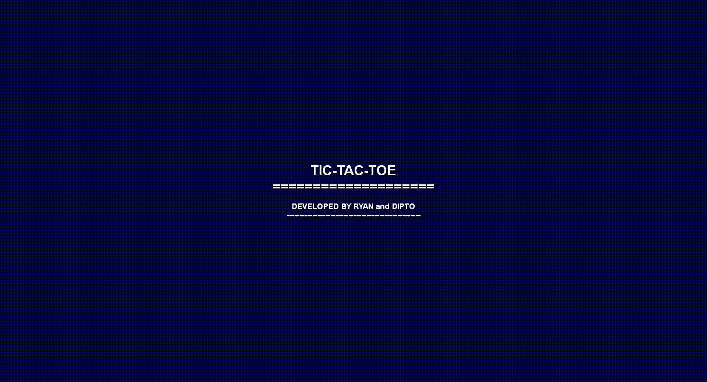

# TICTACTOE GAME

by [Dipto](https://github.com/dipto0321) and [Ryan](https://github.com/rvvergara)

Classic tictactoe game played boringly in the command line. But don't be deceived. It's still as awesome as its graphic cousins.

Game was programmed in Ruby and utilizes an object oriented approach.

## Getting Started

In order to play the game in your computer you need to clone this repository:

`git clone git@github.com:rvvergara/tictactoe.git`

## Prerequisites

### Windows Users:

Go to bin folder and unzip tictactoe.zip file and run tictactoe.exe

### Linux Users:

You will need at least Ruby 2.5.1 installed in your computer in order to play this game.

To install Ruby visit its [installation instructions page](https://www.ruby-lang.org/en/documentation/)

### Screenshots



```
Our game board format
=========================

      0 | 1 | 2
      ---------
      3 | 4 | 5
      ---------
      6 | 7 | 8
```

### Enjoy the game!
